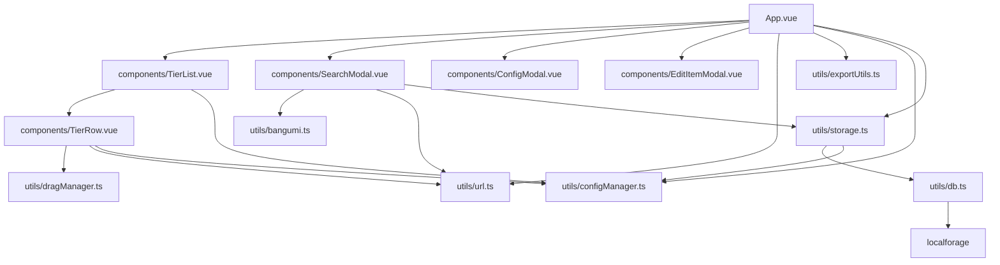

# 架构分析报告

## 1. 依赖关系可视化 (Mermaid Map)

下图展示了当前 `src/` 目录下的模块依赖关系。

## 2. 变更影响模拟 ("What-If" Analysis)

### 场景 A: 将 `localforage` 替换为远程 API

- **影响程度**: 高 (High)
- **受影响模块**:
  - `src/utils/db.ts`: 需要完全重写。
  - `src/utils/storage.ts`: 需要中等程度的修改。接口 (`saveTierData`, `loadTierData`) 可以保持不变，但需要调整同步/异步行为以适应网络延迟。
  - `App.vue`: 影响较低，前提是 `storage.ts` 保持基于 Promise 的 API 接口。
- **风险**: 数据迁移策略（从本地到远程）将会比较复杂。

### 场景 B: 修改 `AnimeItem` 数据结构

- **影响程度**: 严重/系统级 (Critical/System-wide)
- **受影响模块**:
  - `src/types.ts`: 定义变更。
  - `App.vue`: 保存/加载逻辑，迁移逻辑，Hydration逻辑。
  - `TierRow.vue`: 渲染逻辑，拖拽传递的对象。
  - `SearchModal.vue`: API 结果映射逻辑。
  - `storage.ts`: 迁移和验证逻辑。
- **风险**: 如果字段（如 `image`）被重命名或类型更改，而没有更新所有的映射函数，极有可能导致功能回退（Regression）。

## 3. 依赖倒置原则 (DIP) 审查

- **状态**: 混合 (Mixed)
- **违规点**: `storage.ts` 导入了 `db.ts`，而 `db.ts` 直接创建了一个 `localforage` 实例。
  - _批评_: 高层存储逻辑依赖于底层的数据库实现细节。
  - _修正建议_: `db.ts` 应该导出一个 `DatabaseProvider` 接口，而 `localforage` 应该只是运行时注入或选择的一个实现。
- **合规点**: `App.vue` 依赖于 `storage.ts`（存储的抽象层），而不是直接依赖 `db.ts` 或 `localforage`。这符合 DIP。

## 4. 单一职责原则 (SRP) 与泄露检测

### `App.vue` (单体控制器 - Monolithic Controller)

- **问题**: `App.vue` 处理了太多事务：
  1.  布局与视图组合 (Layout & View Composition)
  2.  全局状态管理 (Global State Management: `tiers`, `unrankedTiers`)
  3.  数据持久化触发器 (Data Persistence triggers)
  4.  迁移逻辑 (Migration Logic: `migrateItem`)
  5.  Hydration 逻辑 (Hydration Logic: `URL.createObjectURL`)
  6.  导入/导出编排 (Export/Import orchestration)
- **结论**: **违反 SRP**。它在“视图逻辑”之外做了太多的“业务逻辑”。
- **建议**: 将状态管理和持久化逻辑提取到一个专门的 composable 中（例如 `useTierData.ts`）。

### `TierRow.vue` (拖拽逻辑)

- **问题**: 它包含大量的拖拽事件处理和坐标计算逻辑。
- **结论**: 目前尚可接受，但处于违规边缘。`dragManager.ts` 帮助分担了一些复杂性，但 `handledrop`/`reorder` 逻辑在组件中仍然很重。

### 抽象泄露 (Leaky Abstractions)

- **`SearchModal.vue`**: 它对 `AnimeItem` 的构造细节（生成 ID，映射字段）了解过多。这些逻辑重复了 `TierRow.vue` 中（用于本地上传）的项目创建逻辑。
  - _修复建议_: 集中化 `createAnimeItem(file/data)` 工厂函数。
