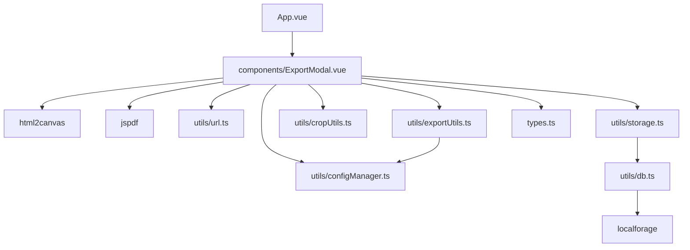

# ExportModal 导出功能开发文档

## 0. 范围与目标

本文档聚焦 `src/components/ExportModal.vue` 的导出功能（图片 / PDF / JSON），覆盖：
- 依赖关系可视化
- 导出流程与关键实现点
- 依赖倒置原则 (DIP) 审查
- 变更影响模拟 (What-If)
- 单一职责原则 (SRP) 与泄露检测

## 1. 依赖关系可视化 (Mermaid)

说明：
- `ExportModal` 是流程编排核心，直接依赖 `html2canvas` / `jspdf` 以及多个内部工具模块。
- `ExportUtils` 复用导出图像的裁剪 / DOM 处理逻辑，但仍依赖 `configManager` 获取尺寸。
- `storage.ts` 在 JSON 导出中作为数据来源（`exportAllData`）。

## 2. 导出功能概述

### 2.1 支持的导出类型
- **图片 (JPG)**：通过 `html2canvas` 将克隆 DOM 渲染为画布，并下载为 JPEG。
- **PDF**：与图片导出同源，但使用 `jspdf` 输出 PDF，并在对应位置添加超链接。
- **JSON**：调用 `exportAllData()` 导出结构化数据，包含图片 Base64、配置与元信息。

### 2.2 主要输入（Props）
- `tiers: Tier[]`：导出目标数据，PDF 链接映射用。
- `tierConfigs: TierConfig[]`：JSON 导出包含在 `exportAllData()` 返回中。
- `appContentRef: HTMLElement | null`：导出 DOM 源。
- `title: string` / `titleFontSize: number`：PDF 导出使用传入的字体大小。
- `exportScale: number`：用于高清导出倍率。

### 2.3 关键内部状态
- `isExportingImage` / `isExportingPDF`：互斥的导出状态锁。
- `exportProgress`：导出进度提示。

## 3. 关键流程（按导出类型）

### 3.1 图片导出流程
1. 校验 `appContentRef`；锁定导出状态。
2. 将页面滚动到顶部，克隆 DOM 到隐藏容器。
3. 同步主题、隐藏 UI、处理空位。
4. 处理图片：
   - CORS 代理（默认 `wsrv.nl`，VNDB 使用 `i0.wp.com`）
   - Canvas 裁剪（`cropImageWithCanvas`）
   - CSS 裁剪兜底（`applySmartCropToImage`）
5. 计算标题字号（从 `.title` 获取）并配置导出样式。
6. `html2canvas` 渲染生成画布。
7. 下载 JPEG 并清理临时 DOM。

### 3.2 PDF 导出流程
在图片导出流程基础上增加：
- **链接收集**：遍历 `tiers`，通过 DOM 定位 `.tier-item`，计算相对坐标；使用 `getItemUrl()` 生成超链接。
- **PDF 生成**：以画布宽高比计算纸张尺寸，`pdf.addImage` 嵌入图像后，使用 `pdf.link` 添加可点击区域。

### 3.3 JSON 导出流程
1. 调用 `exportAllData()`，将 Blob 转回 Base64。
2. 生成 JSON 文件并下载。

## 4. 依赖倒置原则 (DIP) 审查

### 4.1 违背 / 风险点
- `ExportModal.vue` 直接依赖具体库实现：`html2canvas` 与 `jspdf`。
- `ExportModal.vue` 直接操作 DOM 与浏览器 API（`document`/`window`/`getComputedStyle`）。
- `ExportUtils` 依赖 `configManager` 取尺寸值，抽象层仍向下依赖具体实现。

### 4.2 合规 / 部分符合
- `processExportImages` 通过函数参数注入裁剪与 CORS 处理逻辑，具备一定可替换性。

### 4.3 建议改进
- 引入 `ExportRenderer` / `PdfExporter` 抽象接口（或 composable），将库依赖下沉至实现层。
- 将 DOM 与样式处理放入 `exportService`，UI 层只负责触发与状态展示。

## 5. 变更影响模拟 (What-If Analysis)

### 场景 A：替换 `html2canvas` 为其他渲染库
- **影响程度**：高
- **受影响模块**：`ExportModal.vue`（核心导出）、`exportUtils.ts`（可能要适配图片处理时机）。
- **风险**：渲染结果差异导致裁剪、背景、字体渲染不一致。

### 场景 B：修改图片裁剪逻辑（改为纯 CSS）
- **影响程度**：中
- **受影响模块**：`ExportModal.vue`（`cropImageWithCanvas`）、`exportUtils.ts`（`processExportImages` 调度）。
- **风险**：Canvas 裁剪与导出视觉一致性下降，导出边界可能失真。

### 场景 C：调整配置系统（`image-width/height` 改名）
- **影响程度**：高
- **受影响模块**：`exportUtils.ts`、`ExportModal.vue`（图片尺寸依赖）。
- **风险**：导出图片尺寸异常，裁剪坐标错误。

### 场景 D：更改 DOM 结构（`tier-item` / `data-item-id` 重命名）
- **影响程度**：高
- **受影响模块**：`ExportModal.vue`（PDF 链接映射、图片裁剪定位）。
- **风险**：PDF 链接失效、裁剪错位或空白区域。

### 场景 E：将导出迁移至 Web Worker
- **影响程度**：中-高
- **受影响模块**：`ExportModal.vue`（与 DOM 交互的步骤需重构）、`exportUtils.ts`。
- **风险**：Worker 无法访问 DOM，需切换到 OffscreenCanvas 或序列化 DOM 方案。

## 6. 单一职责原则 (SRP) 与泄露检测

### 6.1 SRP 审查
`ExportModal.vue` 同时承担：
- UI 展示与交互状态管理
- DOM 克隆与隐藏容器管理
- 图片处理、裁剪算法与 CORS 逻辑
- PDF 链接坐标计算
- 文件下载与错误处理

**结论**：职责过多，属于 SRP 违反风险。

建议拆分：
- `useExportService.ts`：封装导出流程与错误处理
- `exportDomRenderer.ts`：负责 DOM 克隆与样式修饰
- `exportImagePipeline.ts`：负责图片加载、裁剪与 CORS 处理

### 6.2 抽象泄露 (Leaky Abstractions)

**泄露点 1：DOM 结构耦合**
- 依赖 `.tier-item`、`data-item-id`、`data-row-id`、`.title`、`.header`、`.candidates-box`、`.divider` 等类名与结构。
- 一旦模板结构变化，导出逻辑即失效。

**泄露点 2：尺寸配置耦合**
- `processExportImages` 使用 `getSize('image-width' | 'image-height')`，强依赖配置键名与计算逻辑。

**泄露点 3：URL 与资源来源**
- CORS 逻辑硬编码 `wsrv.nl`、`i0.wp.com` 与 `vndb.org`，易受域名策略变化影响。
- VNDB 由于屏蔽了 `wsrv.nl` 且直连会污染画布（Tainted Canvas），需特殊处理。

**建议**：
- 将 DOM 选择器、数据属性等集中为导出专用常量或适配层。
- 对外暴露可配置的 CORS 代理与图像源策略。
- 引入“导出渲染模型”，避免导出逻辑直接依赖页面 DOM 结构。

## 7. 维护要点与测试建议

- 测试图片导出：确保裁剪与 UI 隐藏生效（空位隐藏、候选框隐藏、标题显示）。
- 测试 PDF 导出：校验点击链接的位置与目标 URL 正确。
- 测试 JSON 导出：包含 Base64 图像、title、titleFontSize、tierConfigs、version 字段。
- 建议新增：导出前后 DOM 清理检查，避免隐藏容器残留。
